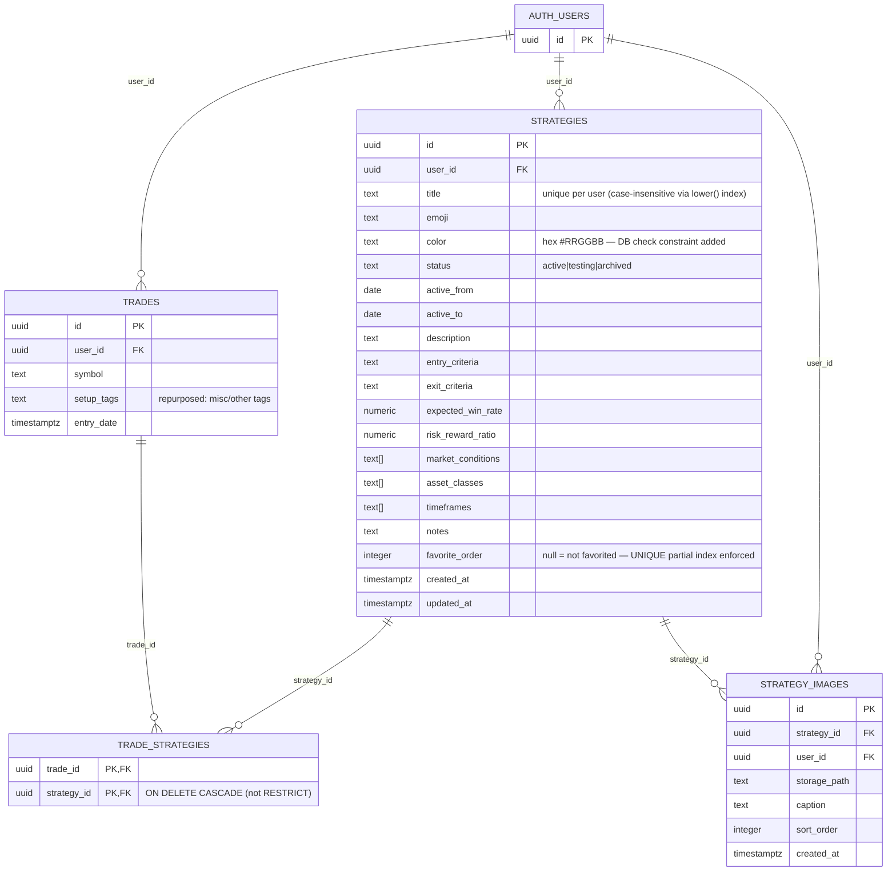

# feat: Strategies Tab + Strategy-Aware Trade Entry

---

**Type:** feat
**Date:** 2026-03-10
**Risk Lane:** C
**Feature Brief:** `docs/feature-briefs/2026-03-10-strategies-tab.md`
**Platform:** iOS (primary QA), Android (smoke)

---

## Enhancement Summary

**Deepened on:** 2026-03-10
**Research agents used:** architecture-strategist, julik-frontend-races-reviewer, performance-oracle, security-sentinel, data-migration-expert, data-integrity-guardian, kieran-typescript-reviewer, code-simplicity-reviewer, deployment-verification-agent, schema-drift-detector, best-practices-researcher, framework-docs-researcher, repo-research-analyst, spec-flow-analyzer (14 agents, 14/14 completed)

### Critical Pre-Implementation Fixes Required

The following issues MUST be resolved before writing any code. They affect data integrity, security, and correctness.

**Security / Data Integrity (Migration):**
1. `trade_strategies` RLS policy is missing a `WITH CHECK` clause — any authenticated user can insert junction rows pointing to another user's trade. Add strategy ownership check to the EXISTS clause.
2. `strategy_images` INSERT can reference a strategy owned by a different user. Add `WITH CHECK` that validates `strategy_id` belongs to `auth.uid()`.
3. `on delete restrict` on `trade_strategies.strategy_id` will block `auth.users` cascade deletion (GDPR failure). Change to `ON DELETE CASCADE`.
4. `strategy-images` bucket must be created in `config.toml` BEFORE the migration is applied. Storage policies reference it by name.
5. Add `UNIQUE (user_id, favorite_order)` partial index — app-level compaction is insufficient without DB enforcement.

**Race Conditions (Data Loss Risk):**
6. `useSetStrategyOnTrade` must be called in the SAME async block as `createTrade` / `updateTrade`, with navigation gated on complete success of both. Current plan structure would navigate away before junction rows are inserted.
7. "Save Placeholder" chip auto-add must use `mutateAsync` and `await` before calling `onStrategyCreated` — adding the chip before the mutation resolves means the junction row will have no `strategy.id` at trade save time.
8. In edit mode, the Save button must be disabled while `useStrategiesForTrade` is loading or errored. A silent submit against an empty initial state will DELETE all existing strategy associations for the trade.

**Routing:**
9. `app/strategy/[id].tsx` and `app/strategy/new.tsx` must be `app/(tabs)/strategies/[id].tsx` and `app/(tabs)/strategies/new.tsx` to match the `journal/[id].tsx` precedent. The current path is outside the tab group.

**Framework:**
10. `react-native-reanimated` v4 requires the `react-native-worklets` package and a changed Babel plugin (`react-native-worklets/plugin`). `useAnimatedGestureHandler` is fully removed. Verify `app.json` has New Architecture enabled.

### Key Simplifications (Adopt Before Phase 1)

These reduce scope without changing user-visible behavior:

- **Cut `useDeleteStrategy`** — no UI consumer in Phase 1, only adds risk to a table with `on delete restrict`.
- **Replace drag-and-drop reorder with up/down arrows in Phase 1** — the plan already names this as the fallback. Eliminates the reanimated v4 API risk entirely. Promote to drag-and-drop in Phase 2 if user feedback warrants.
- **Defer the ephemeral checklist toggle to Phase 2** — no persistence means no durable value in Phase 1. Saves ~40 LOC across two screens.
- **Don't create `NoStrategyNudge.tsx`** — the plan already recommends `Alert.alert()`. Use it.
- **Merge `app/(modals)/strategy-create.tsx` into `app/(tabs)/strategies/new.tsx`** with a `?modal=true&title=X` query param. Two files for one screen doubles maintenance surface.
- **Replace dual-source stats with junction-only query + one-time migration on strategy creation** — the backward-compat `setup_tags` ILIKE path should run once when a strategy is first saved (migrating matching tags), not on every stats load.
- **Remove `last_used_at` column** — at personal-journal scale, a `MAX(created_at)` subquery is not expensive. The column adds write complexity and a correctness gap when trades are deleted.

### New Design Decisions (Resolving Spec Flow Gaps)

Six new decisions added as #19–24 in the Design Decisions table below.

---

## Overview

This plan adds a first-class "Strategies" system to the Trade Journal app. Traders define their named setups once in a dedicated Strategies tab, then pick from their own list when logging trades. Every strategy selection is stored via a proper junction table (`trade_strategies`) — not free-text arrays — giving the app clean, queryable data from day one as the foundation for AI performance analysis later.

The feature touches four layers: database schema (3 new tables + 1 new storage bucket), server state (new TanStack Query hooks), UI (1 new tab, 3 new screens, 4 new components), and an existing screen (TradeForm refactor). It is Lane C.

---

## Problem Statement

The current "Setup Tags" field on trade entry is a free-text array with no persistence, no descriptions, and no referential integrity. A user types "Breakout Retest" on one trade and "breakout retest" on another — they are treated as different strategies. There is no place to define what a strategy means, document its rules, or measure its performance over time. This makes any future AI analysis unreliable before it even starts.

---

## Proposed Solution

1. **Strategies tab** — a full CRUD interface where the user creates and manages their playbook of named setups with rich metadata (description, entry/exit criteria, expected win rate, R:R, market conditions, timeframes, photo examples, active date range, emoji/color label).
2. **Trade entry integration** — the "Setup Tags" section becomes "Strategy Tags", drawing from the user's own strategy list. Multi-select. Favorites surface first. If the user types an unknown name, a prompt offers to create a placeholder.
3. **Junction table** — strategy selections on trades are stored in `trade_strategies (trade_id, strategy_id)`, replacing the text-array pattern for strategies. The existing `setup_tags` column is repurposed as "Other Tags" for miscellaneous free-text labels.
4. **Computed stats panel** — each strategy's detail screen shows live stats computed from all linked trades (win rate, avg R:R, total P&L, best/worst trade).

### Research Insights: Simplification Opportunities

**YAGNI violations identified (cut before implementation begins):**

- `useDeleteStrategy` — no UI consumer in Phase 1. A hard-delete on a table with `ON DELETE RESTRICT` is the most dangerous mutation possible. Cut entirely; add a code comment for future intent.
- `FavoriteOrderModal` drag-and-drop — the plan's own risk table names up/down arrows as the fallback. Start there. Saves ~80 LOC and eliminates the medium-likelihood reanimated v4 API risk.
- Ephemeral checklist toggle — no persistent output. Move to Phase 2 alongside the "pre-trade checklist prompt" feature where it delivers actual value. Saves ~40 LOC across two screens.
- `NoStrategyNudge.tsx` component file — the plan already recommends `Alert.alert()`. Do not create a separate file.
- `app/(modals)/strategy-create.tsx` duplicate screen — parameterize `app/(tabs)/strategies/new.tsx` with `?modal=true&title=X` instead. Two nearly-identical files for one screen is a maintenance trap.
- `last_used_at` denormalized column — compute `MAX(created_at)` from `trade_strategies` in the sort query on demand. At personal-journal scale this is not expensive, and the column introduces write complexity and a correctness gap when trades are deleted.

**Estimated total LOC saved by these cuts: ~360 lines (~25–30% of planned new code).**

---

## Design Decisions (Resolving SpecFlow Gaps)

The following decisions are made here to remove ambiguity before implementation begins. These are binding for this phase.

| # | Gap | Decision |
|---|-----|----------|
| 1 | Computed stats data source | Query `trade_strategies` JOIN for all trades. On strategy creation, run a one-time migration: insert `trade_strategies` rows for any existing `setup_tags` entries that ILIKE-match the new strategy title. Use junction-only query in `useStrategyStats` thereafter. **Eliminates the dual-source complexity entirely.** |
| 2 | "Full details →" navigation and form state | Strategy create screen is presented as a **modal** (Expo Router `presentation: 'modal'`) over the trade form. The trade form is preserved in the navigation stack underneath. On close/save of the modal, the user lands back on the trade form. |
| 3 | Auto-add chip after "Save Placeholder" | **Yes** — after creating a placeholder strategy, `mutateAsync` must resolve with the full `Strategy` row before the chip is added and the modal closes. Use `await mutateAsync(...)` — never fire-and-forget. |
| 4 | Unfavoriting — modal behavior | Unfavoriting does **not** reopen the reorder modal. Ranks are auto-compacted via a server-side Postgres function (atomic). The reorder modal only opens on the add-favorite action. Favorite button disabled while any unfavorite mutation is `isPending`. |
| 5 | FavoriteOrderModal dismissal (no confirm) | Modal has an explicit **Cancel** button and a Confirm button. iOS swipe-to-dismiss is **disabled**. On Cancel: strategy stays favorited, rank stays at auto-assigned bottom position. **Phase 1 uses up/down arrows for reordering (not drag-and-drop).** Drag-and-drop promoted to Phase 2 after stability is confirmed. |
| 6 | Title uniqueness validation | Validated **on blur** with a debounced Supabase check. The Save button is **disabled** while the debounce is pending (`isCheckPending` state). In edit mode, the query must add `.neq('id', currentStrategyId)` to exclude the current strategy's own title. Error shown inline. Also caught on submit as fallback. |
| 7 | Sort interaction with grouping | Sort by **Status** = grouped view (Favorites → Active → Testing → Archived). Sort by **Win Rate** or **Most Recently Used** = flat list, favorites pinned at absolute top (no group headers), rest sorted. |
| 8 | "Most Recently Used" definition | Computed via `MAX(ts.created_at) FROM trade_strategies ts WHERE ts.strategy_id = id` subquery in the `useStrategies` sort query. **No `last_used_at` column added** — compute on demand. Stale-on-delete risk eliminated. |
| 9 | Swipe-to-archive | **Two-step**: swipe left reveals a red "Archive" action button. User must tap it to confirm. No immediate archive on full swipe. |
| 10 | Post-create navigation | After saving a new strategy: navigate to the **strategy detail screen**. If the create was triggered from "Full details →" in the trade form modal, dismiss the modal back to the trade form instead. |
| 11 | Archived group on list | Collapsed by default. A "Show archived (N)" footer button expands it in-place. |
| 12 | Strategy image limit | **8 images** per strategy (vs 5 for trades — strategies are documentation-heavy). |
| 13 | Unsaved changes alert | **Yes** — if the user has modified any field on the create/edit screen and taps back/cancel, show "Discard changes?" alert with Discard / Keep Editing options. Track `isDirty` from RHF AND a separate `strategiesWereTouched` ref for strategy-chip changes (which are outside RHF). |
| 14 | Checklist toggle state | **Deferred to Phase 2.** Not implemented in Phase 1. Entry/exit criteria render as plain multiline TextInput only. |
| 15 | Archived + favorited conflict | Archiving a strategy **automatically clears its favorite status** (`favorite_order = null`). Enforced in `useArchiveStrategy` mutation. |
| 16 | `useImages` bucket refactor | Add a `bucketName` parameter to `useImages` hook (default `'trade-images'`). Also parameterize `getImageUrl` and `getSignedImageUrl` utility functions. Strategy screens pass `'strategy-images'`. The `strategy-images` bucket must be **private** (not public); always use `getSignedImageUrl`, never `getImageUrl`. |
| 17 | Detail screen edit mode | **Always-editable inline** fields (no edit toggle). The read-only computed stats panel appears at the top as a non-editable card. All other fields are directly editable. Save button visible but **disabled when `!isDirty && !strategiesWereTouched`**. |
| 18 | Strategy tags in trade edit mode | **Yes** — existing trades can have strategies added/removed in edit mode. **The Save button must be disabled while `useStrategiesForTrade` is in loading or error state.** When the query resolves, initialize `selectedStrategies` without marking `strategiesWereTouched`. Adding or removing a strategy chip sets `strategiesWereTouched = true`. |
| 19 | StrategyPickerSheet "Create" option visibility | Show "Create '[typed name]'" option only when **no exact case-insensitive match** exists in the current results. If a match is found (e.g., user types "breakout retest", "Breakout Retest" exists), show the existing strategy as a selectable result but suppress the "Create" option. This prevents duplicate strategies from case-variation typos. |
| 20 | Strategy detail not-found / unauthorized state | When `useStrategy(id).data` is `undefined` and `isLoading` is `false`, render a full-screen "Strategy not found" message with a back button. Do not render an empty editable form — this is indistinguishable from a create screen and could cause accidental overwrites. |
| 21 | Edit mode strategy save guard | If `useStrategiesForTrade` is in `isPending` or `isError` state when the user taps Save, **block the save** entirely. Show an inline error in the strategy chip section with a retry prompt. Never compute a strategy diff against an empty initial state — this would DELETE all existing strategy associations. |
| 22 | Partial save: `useSetStrategyOnTrade` failure | If the trade is saved but `useSetStrategyOnTrade` subsequently fails, surface a non-dismissible alert: "Trade saved, but strategy tags failed to link — tap to retry." Retain the strategy IDs in component state for the retry. Do NOT navigate away until both mutations succeed. |
| 23 | Win rate with no closed trades | `useStrategyStats` filters for `status = 'closed'` trades only (consistent with `useTradeStats`). When 0 closed trades exist, all rate/average fields return `null`. The stats panel renders "—" (not "0%") for `winRate` and `avgRealizedRR` when `totalClosedTrades === 0`. |
| 24 | "Full details →" modal discard | If the user opens `strategies/new.tsx` via "Full details" and discards the form, the `StrategyPlaceholderModal` is **re-opened** with the original title still populated. The user is not dropped directly onto the trade form with no path back to "Save Placeholder". |

---

## Technical Approach

### Architecture

```
app/(tabs)/
  _layout.tsx          ← add 4th Strategies tab
  strategies/
    index.tsx          ← Strategy list screen (Stack entry point)
    new.tsx            ← Create strategy screen (also serves modal path via ?modal=true&title=X)
    [id].tsx           ← Detail / edit strategy screen

src/
  hooks/
    use-strategies.ts  ← All TanStack Query hooks for strategies
  utils/
    strategy-payloads.ts   ← Pure functions: rank compaction, reorder mapping, stats aggregation
    strategy-query.ts      ← Filter/sort composition functions (mirrors trade-query.ts)
  types/
    strategies.ts      ← Zod schemas + DB type aliases + query keys
    common.ts          ← Shared constants: ASSET_CLASS_VALUES, TIMEFRAME_VALUES (dedup from trades.ts)
  components/
    StrategyTagsSection.tsx    ← Extracted section from TradeForm
    StrategyPickerSheet.tsx    ← Multi-select sheet + inline placeholder prompt
    FavoriteOrderModal.tsx     ← Up/down arrow reorder sheet (drag-drop in Phase 2)
    StrategyStatsPanel.tsx     ← Computed stats card on detail screen

supabase/
  migrations/
    00002_strategies.sql       ← All new tables + RLS + indexes + bucket policies
  config.toml                  ← Add strategy-images bucket (MUST be added before migration)
```

**Key routing change from original plan:** `app/strategy/` moved to `app/(tabs)/strategies/` to match the `app/(tabs)/journal/[id].tsx` precedent. The Expo Router file-system convention requires screens navigated from a tab to live within that tab's directory.

**New utility layer:** `src/utils/strategy-payloads.ts` and `src/utils/strategy-query.ts` — pure functions extracted from `use-strategies.ts` following the `trade-payloads.ts` / `trade-query.ts` pattern. Hooks remain thin TanStack Query wrappers.

**Component count reduced:** `StrategyPlaceholderModal.tsx` merged into `StrategyPickerSheet.tsx`. `NoStrategyNudge.tsx` not created (use `Alert.alert()`). `app/(modals)/strategy-create.tsx` not created (parameterize `new.tsx`).

### Entity Relationship Diagram



### Research Insights: Architecture

**Routing convention fix (critical):**
The existing codebase uses `app/(tabs)/journal/[id].tsx` for screens navigated from the journal tab. The same convention requires `app/(tabs)/strategies/[id].tsx` and `app/(tabs)/strategies/new.tsx`. Using `app/strategy/` (outside tab groups) breaks file-system routing conventions and means the screens won't inherit the tab navigator's header/style configuration.

**Utility layer is required by existing conventions:**
`use-trades.ts` contains no business logic — all pure functions live in `src/utils/trade-payloads.ts` and `src/utils/strategy-query.ts`. The unit tests in Phase 5 already call "pure functions exported from `use-strategies.ts`" — those functions are in the wrong layer. Move them to `src/utils/strategy-payloads.ts` before writing any code.

**`TradeForm.onSubmit` signature must be updated:**
Currently: `onSubmit(data: TradeFormData, imagePaths: string[])`. With strategies, add a third argument: `onSubmit(data: TradeFormData, imagePaths: string[], strategyIds: string[])`. The calling screens (`add.tsx`, `journal/[id].tsx`) must own the `useSetStrategyOnTrade` call — consistent with how they currently own image linking. `TradeForm` should only surface `selectedStrategies` through its submit callback, not execute cross-domain mutations internally.

**`ASSET_CLASSES` enum duplication:**
`src/types/strategies.ts` would create a third declaration of `ASSET_CLASSES` (duplicates exist in `trades.ts` and `TradeForm.tsx`). Extract to `src/types/common.ts` (or `src/lib/constants.ts`) in Phase 0. Import in both `trades.ts` and `strategies.ts`. Future changes need only one edit.

**`app/(modals)` stack layout must be decided in Phase 0:**
Expo Router v4 requires modal routes to be registered inside a `Stack` navigator with `presentation: 'modal'` on the screen. Since `new.tsx` serves both the push and modal cases via `?modal=true`, register it in `app/(tabs)/strategies/_layout.tsx` as a `Stack.Screen` — no new route group needed.

**`use-images.ts` refactor scope:**
Three places hardcode `'trade-images'`: the upload call (line 87), `getImageUrl` (line 130), and `getSignedImageUrl` (line 135). All three must be parameterized. The `strategy-images` bucket must only use `getSignedImageUrl` — the bucket is private, so `getImageUrl` (which calls `getPublicUrl`) will not work.

---

## Implementation Phases

### Phase 0 — Foundation (no UI)

**Goal:** Lay all data and type infrastructure before any screen work. Everything in this phase is testable in isolation.

#### Step 0.1 — `supabase/migrations/00002_strategies.sql`

**PREREQUISITE: `strategy-images` bucket must exist in `config.toml` before this migration runs. The storage policies reference it by name.**

```sql
-- ============================================
-- STRATEGIES
-- ============================================
create table public.strategies (
  id                uuid default gen_random_uuid() primary key,
  user_id           uuid references auth.users on delete cascade not null,
  title             text not null,
  emoji             text,
  color             text check (color is null or color ~ '^#[0-9A-Fa-f]{6}$'),
  status            text not null default 'active'
                      check (status in ('active', 'testing', 'archived')),
  active_from       date,
  active_to         date,
  description       text check (description is null or char_length(description) <= 2000),
  entry_criteria    text check (entry_criteria is null or char_length(entry_criteria) <= 2000),
  exit_criteria     text check (exit_criteria is null or char_length(exit_criteria) <= 2000),
  expected_win_rate numeric(5,2)
                      check (expected_win_rate between 0 and 100),
  risk_reward_ratio numeric(10,4)
                      check (risk_reward_ratio > 0),
  market_conditions text[] default '{}',
  asset_classes     text[] default '{}',
  timeframes        text[] default '{}',
  notes             text check (notes is null or char_length(notes) <= 2000),
  favorite_order    integer check (favorite_order > 0 and favorite_order <= 100),
  created_at        timestamptz default now() not null,
  updated_at        timestamptz default now() not null,
  check (char_length(title) >= 1 and char_length(title) <= 100),
  check (active_to is null or active_from is null or active_to >= active_from),
  check (active_from is not null or active_to is null)  -- can't have end without start
);

alter table public.strategies enable row level security;

-- Split policies for explicit WITH CHECK on INSERT/UPDATE (prevents user_id field reassignment)
create policy "strategies_select"
  on public.strategies for select using (auth.uid() = user_id);
create policy "strategies_insert"
  on public.strategies for insert with check (auth.uid() = user_id);
create policy "strategies_update"
  on public.strategies for update
  using (auth.uid() = user_id)
  with check (auth.uid() = user_id);
create policy "strategies_delete"
  on public.strategies for delete using (auth.uid() = user_id);

-- Case-insensitive unique title per user (replaces plain unique constraint)
create unique index idx_strategies_user_title_ci
  on public.strategies (user_id, lower(title));
create index idx_strategies_user on public.strategies (user_id);
create index idx_strategies_user_status on public.strategies (user_id, status);

-- Unique partial index enforces favorite_order uniqueness at DB level
create unique index uq_strategies_user_favorite_order
  on public.strategies (user_id, favorite_order)
  where favorite_order is not null;

create trigger strategies_updated_at
  before update on public.strategies
  for each row execute function public.update_updated_at();

-- ============================================
-- TRADE_STRATEGIES (junction)
-- ============================================
create table public.trade_strategies (
  trade_id    uuid references public.trades on delete cascade not null,
  strategy_id uuid references public.strategies on delete cascade not null,  -- CASCADE not RESTRICT (RESTRICT blocks auth.users cascade → GDPR failure)
  primary key (trade_id, strategy_id)
);

alter table public.trade_strategies enable row level security;

-- Both trade AND strategy must belong to auth.uid() — prevents cross-user junction rows
create policy "trade_strategies_select"
  on public.trade_strategies for select
  using (
    exists (select 1 from public.trades t where t.id = trade_id and t.user_id = auth.uid())
  );
create policy "trade_strategies_insert"
  on public.trade_strategies for insert
  with check (
    exists (select 1 from public.trades t where t.id = trade_id and t.user_id = auth.uid())
    and exists (select 1 from public.strategies s where s.id = strategy_id and s.user_id = auth.uid())
  );
create policy "trade_strategies_delete"
  on public.trade_strategies for delete
  using (
    exists (select 1 from public.trades t where t.id = trade_id and t.user_id = auth.uid())
  );

create index idx_trade_strategies_trade on public.trade_strategies (trade_id);
create index idx_trade_strategies_strategy on public.trade_strategies (strategy_id);

-- ============================================
-- STRATEGY_IMAGES
-- ============================================
create table public.strategy_images (
  id           uuid default gen_random_uuid() primary key,
  strategy_id  uuid references public.strategies on delete cascade not null,
  user_id      uuid references auth.users on delete cascade not null,
  storage_path text not null check (storage_path <> ''),
  caption      text,
  sort_order   integer default 0,
  created_at   timestamptz default now() not null
);

alter table public.strategy_images enable row level security;

-- WITH CHECK verifies strategy_id ownership — prevents cross-user image insertion
create policy "strategy_images_select"
  on public.strategy_images for select using (auth.uid() = user_id);
create policy "strategy_images_insert"
  on public.strategy_images for insert
  with check (
    auth.uid() = user_id
    and exists (
      select 1 from public.strategies s
      where s.id = strategy_images.strategy_id and s.user_id = auth.uid()
    )
  );
create policy "strategy_images_update"
  on public.strategy_images for update
  using (auth.uid() = user_id)
  with check (auth.uid() = user_id);
create policy "strategy_images_delete"
  on public.strategy_images for delete using (auth.uid() = user_id);

create index idx_strategy_images_strategy on public.strategy_images (strategy_id);
create index idx_strategy_images_user on public.strategy_images (user_id);

-- ============================================
-- STORAGE: strategy-images bucket policies
-- (Bucket must be created in config.toml FIRST — private, not public)
-- ============================================
-- Positive structure-enforcing regex (replaces weak !~ '\..' check)
create policy "Users can upload strategy images"
  on storage.objects for insert
  with check (
    bucket_id = 'strategy-images'
    and auth.role() = 'authenticated'
    and auth.uid()::text = (storage.foldername(name))[1]
    and name ~ ('^' || auth.uid()::text || '/[0-9a-f-]+/[0-9a-z_.]+$')
  );

create policy "Users can view own strategy images"
  on storage.objects for select
  using (
    bucket_id = 'strategy-images'
    and auth.uid()::text = (storage.foldername(name))[1]
  );

create policy "Users can delete own strategy images"
  on storage.objects for delete
  using (
    bucket_id = 'strategy-images'
    and auth.uid()::text = (storage.foldername(name))[1]
  );
```

**Key changes from original plan:**
- `color` field has DB-level `check` constraint (not just Zod)
- DB-level `char_length` constraints on all free-text fields
- `favorite_order` has upper bound of 100 and a **unique partial index** (not just a non-unique index)
- `trade_strategies.strategy_id` is `ON DELETE CASCADE` (not RESTRICT) — prevents GDPR cascade failure
- `trade_strategies` has split RLS policies with dual ownership `WITH CHECK`
- `strategy_images` INSERT policy verifies `strategy_id` ownership
- `strategies` uses `lower(title)` unique index for case-insensitive uniqueness
- Storage regex is a positive structure enforcer (not a weak negative exclusion)
- `last_used_at` column **removed** (computed on demand in sort query)

#### Step 0.2 — `supabase/config.toml`

Add the `strategy-images` bucket entry **as a private bucket** (not public). This step must be completed before running the migration.

```toml
[storage.buckets.strategy-images]
public = false
file_size_limit = "50MiB"
allowed_mime_types = ["image/jpeg", "image/png", "image/webp", "image/heic"]
```

#### Step 0.3 — `src/types/common.ts` (new)

Extract shared enum constants that are duplicated between `trades.ts` and the new `strategies.ts`:

```ts
// src/types/common.ts
export const ASSET_CLASS_VALUES = ['crypto', 'stocks', 'options', 'futures', 'forex'] as const;
export const TIMEFRAME_VALUES = ['1m', '5m', '15m', '1h', '4h', 'daily', 'weekly'] as const;
```

Update `src/types/trades.ts` and `src/components/TradeForm.tsx` to import from here. This is a three-file change with no behavior impact.

#### Step 0.4 — `src/types/database.ts`

Manually add `strategies`, `trade_strategies`, and `strategy_images` table Row/Insert/Update types following the existing hand-maintained pattern.

**Critical:** After writing, run `supabase gen types typescript --local` and diff against the manual entry. Any discrepancy is schema drift.

Column nullability reference for `strategies.Row`:
- Not null: `id`, `user_id`, `title`, `status` (use literal union `'active' | 'testing' | 'archived'`), `market_conditions`, `asset_classes`, `timeframes`, `created_at`, `updated_at`
- Nullable: `emoji`, `color`, `active_from`, `active_to`, `description`, `entry_criteria`, `exit_criteria`, `expected_win_rate`, `risk_reward_ratio`, `notes`, `favorite_order`

Note: `last_used_at` is **not** in this schema (column was removed from the plan).

#### Step 0.5 — `src/types/strategies.ts`

```ts
// src/types/strategies.ts

import { z } from 'zod';
import type { Database } from './database';
import { ASSET_CLASS_VALUES, TIMEFRAME_VALUES } from './common';

// ── Enum constants ────────────────────────────────────────────────
export const STRATEGY_STATUSES = ['active', 'testing', 'archived'] as const;
export const MARKET_CONDITIONS = [
  'trending', 'choppy', 'high_volatility', 'low_volatility', 'range_bound'
] as const;
export const ASSET_CLASSES = ASSET_CLASS_VALUES;  // imported from common.ts
export const TIMEFRAMES = TIMEFRAME_VALUES;        // imported from common.ts

// ── Full strategy form schema ─────────────────────────────────────
export const strategyFormSchema = z.object({
  title: z.string().min(1, 'Title is required').max(100),
  emoji: z.string().optional(),  // max(2) removed — counts UTF-16 code units, breaks flag/ZWJ emojis
  color: z.string().regex(/^#[0-9A-Fa-f]{6}$/, 'Invalid color').optional(),
  status: z.enum(STRATEGY_STATUSES),
  active_from: z.string().regex(/^\d{4}-\d{2}-\d{2}$/, 'Must be YYYY-MM-DD').optional(),
  active_to: z.string().regex(/^\d{4}-\d{2}-\d{2}$/, 'Must be YYYY-MM-DD').optional(),
  description: z.string().max(2000).optional(),
  entry_criteria: z.string().max(2000).optional(),
  exit_criteria: z.string().max(2000).optional(),
  // z.coerce.number() coerces empty string to 0, not undefined.
  // Use transform to ensure cleared field produces undefined, not 0% win rate.
  expected_win_rate: z.union([z.literal(''), z.coerce.number().min(0).max(100)]).optional()
    .transform(v => v === '' ? undefined : v),
  risk_reward_ratio: z.union([z.literal(''), z.coerce.number().positive()]).optional()
    .transform(v => v === '' ? undefined : v),
  market_conditions: z.array(z.enum(MARKET_CONDITIONS)).default([]),
  asset_classes: z.array(z.enum(ASSET_CLASS_VALUES)).default([]),
  timeframes: z.array(z.enum(TIMEFRAME_VALUES)).default([]),
  notes: z.string().max(2000).optional(),
}).refine(
  (d) => !d.active_from || !d.active_to || new Date(d.active_to) >= new Date(d.active_from),
  { message: 'End date must be after start date', path: ['active_to'] }
).refine(
  (d) => d.active_from != null || d.active_to == null,
  { message: 'Cannot set end date without a start date', path: ['active_to'] }
);

export type StrategyFormData = z.output<typeof strategyFormSchema>;

// Minimal schema for placeholder creation from trade entry
// Derive from STRATEGY_STATUSES to avoid divergence — 'archived' excluded
export const strategyPlaceholderSchema = z.object({
  title: z.string().min(1).max(100),
  description: z.string().max(500).optional(),
  status: z.enum(['active', 'testing'] as [
    typeof STRATEGY_STATUSES[0],
    typeof STRATEGY_STATUSES[1]
  ]),
});
export type StrategyPlaceholderData = z.output<typeof strategyPlaceholderSchema>;

// ── DB type aliases ───────────────────────────────────────────────
export type Strategy = Database['public']['Tables']['strategies']['Row'];
export type StrategyInsert = Database['public']['Tables']['strategies']['Insert'];
export type StrategyUpdate = Database['public']['Tables']['strategies']['Update'];
export type TradeStrategy = Database['public']['Tables']['trade_strategies']['Row'];
export type StrategyImage = Database['public']['Tables']['strategy_images']['Row'];

// ── Typed filter interface (not Record<string, unknown>) ──────────
export interface StrategyFilters {
  status?: typeof STRATEGY_STATUSES[number] | 'all';
  sortBy?: 'status' | 'win_rate' | 'most_recently_used';
}

// ── Query key factory ─────────────────────────────────────────────
export const strategyKeys = {
  all: ['strategies'] as const,
  lists: () => [...strategyKeys.all, 'list'] as const,
  list: (filters?: StrategyFilters) =>
    [...strategyKeys.lists(), filters ?? {}] as const,
  details: () => [...strategyKeys.all, 'detail'] as const,
  detail: (id: string) => [...strategyKeys.details(), id] as const,
  stats: (id: string) => [...strategyKeys.all, 'stats', id] as const,
};

// ── Computed stats type (Zod-derived for consistency with project convention) ──
export const strategyStatsSchema = z.object({
  totalClosedTrades: z.number().int().nonnegative(),
  winRate: z.number().nullable(),        // null when totalClosedTrades = 0; display as "—"
  avgRealizedRR: z.number().nullable(),  // null when totalClosedTrades = 0; display as "—"
  totalPnl: z.number(),
  bestTradePnl: z.number().nullable(),
  worstTradePnl: z.number().nullable(),
});
export type StrategyStats = z.infer<typeof strategyStatsSchema>;

// ── Mutation input types ──────────────────────────────────────────
export interface SetStrategyOnTradeInput {
  tradeId: string;
  strategyIds: string[];  // batch insert — all rows in one call
}
export interface RemoveStrategyFromTradeInput {
  tradeId: string;
  strategyId: string;
}
```

**Key changes from original plan:**
- `emoji` max(2) removed (counts UTF-16 code units, breaks flag/ZWJ emojis)
- `active_from`/`active_to` have `YYYY-MM-DD` regex validator
- `expected_win_rate`/`risk_reward_ratio` transform empty string → `undefined` (not 0)
- Date refine uses `new Date()` comparison (consistent with `trades.ts`)
- `active_to` without `active_from` is now rejected in Zod (matches new DB constraint)
- `strategyPlaceholderSchema` derives from `STRATEGY_STATUSES` (no literal duplication)
- `StrategyFilters` interface replaces `Record<string, unknown>`
- `StrategyStats` is Zod-derived (consistent with project convention)
- `SetStrategyOnTradeInput` / `RemoveStrategyFromTradeInput` explicitly typed
- `last_used_at` removed from all types

#### Step 0.6 — Refactor `src/hooks/use-images.ts`

Add `bucketName: string = 'trade-images'` parameter to the hook factory. Parameterize all three hardcoded `'trade-images'` references: the upload call (line ~87), `getImageUrl` (line ~130), and `getSignedImageUrl` (line ~135). No behavior change for existing callers.

The `strategy-images` bucket is private. Strategy screens must call `getSignedImageUrl` exclusively — never `getImageUrl`.

#### Step 0.7 — `src/utils/strategy-payloads.ts` (new)

Pure functions extracted from the hook layer, testable without TanStack Query or Supabase:
- `compactFavoriteRanks(strategies: Strategy[]): Strategy[]` — renumbers 1..N
- `reorderFavorites(strategies: Strategy[], fromIndex: number, toIndex: number): Strategy[]`
- `aggregateStrategyStats(trades: Trade[]): StrategyStats` — computes all 6 stat fields; handles empty array; `winRate` and `avgRealizedRR` are `null` when `totalClosedTrades === 0`; only counts `status === 'closed'` trades
- `dedupeByTradeId<T extends { id: string }>(a: T[], b: T[]): T[]`

#### Step 0.8 — `src/utils/strategy-query.ts` (new)

Filter/sort query composition functions (mirrors `trade-query.ts`):
- `buildStrategyFilterQuery(supabase, userId, filters: StrategyFilters)` — composes the Supabase chain with status filter and sort order
- For `sortBy: 'most_recently_used'`: use a subquery `ORDER BY (SELECT MAX(created_at) FROM trade_strategies WHERE strategy_id = strategies.id) DESC NULLS LAST`

**Files created/modified in Phase 0:**
- `supabase/migrations/00002_strategies.sql` (new)
- `supabase/config.toml` (modified — add strategy-images bucket as private)
- `src/types/common.ts` (new — shared ASSET_CLASS_VALUES, TIMEFRAME_VALUES)
- `src/types/database.ts` (modified — add 3 new table types)
- `src/types/strategies.ts` (new)
- `src/utils/strategy-payloads.ts` (new)
- `src/utils/strategy-query.ts` (new)
- `src/hooks/use-images.ts` (modified — bucket param + getImageUrl/getSignedImageUrl)

### Research Insights: Phase 0

**RLS policy performance — invert the junction table query (high impact):**
The `trade_strategies` INSERT policy uses an EXISTS correlated subquery. Postgres evaluates `auth.uid()` once per row rather than once per statement. At scale (50k+ rows), this is 50,000 auth calls per query. Rewrite all policies using the inverted IN subquery with `(SELECT auth.uid())` wrapper — the optimizer treats it as an `initPlan` (evaluated once per statement). Supabase community data shows 450x improvement switching from the correlated form. Apply to the migration before shipping:

```sql
-- Replace trade_strategies policies with inverted form
CREATE POLICY "trade_strategies_select"
  ON public.trade_strategies FOR SELECT TO authenticated
  USING (
    trade_id IN (SELECT id FROM public.trades WHERE user_id = (SELECT auth.uid()))
  );

CREATE POLICY "trade_strategies_insert"
  ON public.trade_strategies FOR INSERT TO authenticated
  WITH CHECK (
    trade_id IN (SELECT id FROM public.trades WHERE user_id = (SELECT auth.uid()))
    AND strategy_id IN (SELECT id FROM public.strategies WHERE user_id = (SELECT auth.uid()))
  );
```

Apply the same `(SELECT auth.uid())` wrapper pattern to the `strategies` and `strategy_images` policies, and add `TO authenticated` to all policies to prevent the `anon` role from evaluating policy expressions.

**Reanimated v4 prerequisite check:**
Verify `app.json` has New Architecture enabled (default in Expo SDK 55 / RN 0.83, but confirm `"newArchEnabled"` is not set to `false`). Reanimated v4 requires New Architecture exclusively. Also add `react-native-worklets` package and update `babel.config.js` to use `react-native-worklets/plugin` (not `react-native-reanimated/plugin`).

**Pre-deploy verification queries (run before migration):**
```sql
-- Verify prerequisites exist
SELECT routine_name FROM information_schema.routines
WHERE routine_schema = 'public' AND routine_name = 'update_updated_at';  -- must return 1 row

-- Verify no partial apply
SELECT table_name FROM information_schema.tables
WHERE table_schema = 'public'
AND table_name IN ('strategies', 'trade_strategies', 'strategy_images');  -- must return 0 rows
```

**Post-deploy verification queries:**
```sql
-- Confirm case-insensitive unique index (not plain unique constraint)
SELECT indexname, indexdef FROM pg_indexes
WHERE tablename = 'strategies' AND indexname = 'idx_strategies_user_title_ci';

-- Confirm unique partial index on favorite_order
SELECT indexname FROM pg_indexes
WHERE tablename = 'strategies' AND indexname = 'uq_strategies_user_favorite_order';

-- Confirm ON DELETE CASCADE on strategy_id (not RESTRICT)
SELECT rc.delete_rule FROM information_schema.referential_constraints rc
JOIN information_schema.table_constraints tc ON rc.constraint_name = tc.constraint_name
WHERE tc.table_name = 'trade_strategies';
-- Expected: CASCADE for both trade_id and strategy_id
```

---

### Phase 1 — Strategies Tab: Core CRUD

**Goal:** A fully working Strategies tab where the user can create, view, edit, and archive strategies. No trade entry integration yet.

#### Step 1.1 — `src/hooks/use-strategies.ts`

Follow the `use-trades.ts` pattern exactly. Implement:

```ts
// Queries
useStrategies(filters?: StrategyFilters)  // list; uses strategy-query.ts for composition
useStrategy(id: string)                   // single detail, enabled: !!id
useStrategyStats(id: string)              // computed stats — junction-only query (see below)

// Mutations
useCreateStrategy()      // insert + one-time setup_tags migration + invalidate list
useUpdateStrategy()      // update by id + setQueryData + invalidate list
useArchiveStrategy()     // status='archived' + clear favorite_order + invalidate list + detail
useReorderFavorites()    // batch upsert favorite_order — single .upsert([...]) call
useFavoriteStrategy()    // set favorite_order to (max + 1) + open FavoriteOrderModal
useUnfavoriteStrategy()  // calls compact_favorites Postgres RPC (atomic) + invalidate list

useSetStrategyOnTrade()         // batch insert trade_strategies rows + invalidate stats
useRemoveStrategyFromTrade()    // delete single trade_strategies row + invalidate stats
useStrategiesForTrade(tradeId)  // fetch strategies linked to a specific trade
```

**`useStrategyStats` — junction-only query (no dual-source after Decision 1 change):**

```ts
// 1. Get all trade IDs linked via junction table
const { data: linkedTradeIds } = await supabase
  .from('trade_strategies')
  .select('trade_id')
  .eq('strategy_id', id);

// 2. Fetch trades (only columns needed for aggregation — not SELECT *)
const { data: trades } = await supabase
  .from('trades')
  .select('id, pnl, status, realized_rr')  // NOT select('*') — avoid O(n) full-row payload
  .in('id', linkedTradeIds.map(r => r.trade_id));

// 3. Aggregate using pure function from strategy-payloads.ts
return aggregateStrategyStats(trades);
```

**`useSetStrategyOnTrade` — always batch insert:**

```ts
await supabase
  .from('trade_strategies')
  .upsert(
    strategyIds.map(id => ({ trade_id: tradeId, strategy_id: id })),
    { onConflict: 'trade_id,strategy_id', ignoreDuplicates: true }
  );
```

One network call regardless of strategy count. `onSuccess` must invalidate `strategyKeys.stats(strategyId)` for each affected strategy.

**`useUnfavoriteStrategy` — server-side atomic compaction:**

Call a Postgres RPC function `compact_favorites(p_user_id, p_strategy_id)` instead of read-modify-write in JavaScript. This eliminates the concurrent-unfavorite rank corruption risk. The RPC function sets the target's `favorite_order = null` and then renumbers remaining favorites with `ROW_NUMBER()` in a single atomic update.

**`useCreateStrategy` — one-time setup_tags migration:**

After inserting the strategy row, run a migration query:
```ts
// Find existing trades where setup_tags ILIKE new strategy title — migrate them to junction rows
const { data: matchingTrades } = await supabase
  .from('trades')
  .select('id')
  .ilike('setup_tags', `%${strategy.title}%`)
  .eq('user_id', userId);

if (matchingTrades?.length) {
  await supabase.from('trade_strategies').upsert(
    matchingTrades.map(t => ({ trade_id: t.id, strategy_id: strategy.id })),
    { onConflict: 'trade_id,strategy_id', ignoreDuplicates: true }
  );
}
```

This replaces the dual-source query design (Decision 1). Stats are accurate from first use.

**`onSuccess` invalidation requirement:**
`useSetStrategyOnTrade` must invalidate `strategyKeys.stats(strategyId)` for all affected strategies so the detail screen stats panel refreshes after a trade is linked. Use `queryClient.invalidateQueries({ queryKey: strategyKeys.stats(id) })` per strategy ID.

**Note on TanStack Query v5:** `onSuccess` is removed from `useQuery` in v5. It remains valid on `useMutation`. The existing `use-trades.ts` pattern uses `onSuccess` on mutations only — this is correct. Do not add `onSuccess` to any `useQuery` call.

#### Step 1.2 — `app/(tabs)/strategies/index.tsx`

List screen. Uses FlashList — no native SectionList equivalent exists.

**FlashList sectioned data pattern (required):**
```ts
type SectionHeader = { type: 'header'; label: string };
type StrategyListItem = { type: 'item' } & Strategy;
type ListItem = SectionHeader | StrategyListItem;

// Flatten outside renderItem
const data: ListItem[] = [
  { type: 'header', label: 'Favorites' },
  ...favorites.map(s => ({ type: 'item', ...s })),
  { type: 'header', label: 'Active' },
  ...active.map(s => ({ type: 'item', ...s })),
  // ...
];
```

```tsx
<FlashList
  data={data}
  renderItem={({ item }) =>
    item.type === 'header' ? <SectionHeader label={item.label} /> : <StrategyRow item={item} />
  }
  getItemType={(item) => item.type}   // REQUIRED for correct cell recycling
  estimatedItemSize={72}              // measure actual row height
  keyExtractor={(item) => item.type === 'item' ? item.id : item.label}
  stickyHeaderIndices={headerIndices} // pre-computed array of header positions
/>
```

**Win rate display — do NOT call `useStrategyStats` per list item:**
The list item renders a `win_rate` column. To avoid N parallel stats queries on tab open, only display the win rate if it is already in the TanStack Query cache (from a prior detail screen visit). Use `queryClient.getQueryData(strategyKeys.stats(id))` synchronously — render "—" if not cached. This avoids 20+ parallel queries on cold list load.

**Swipe-to-archive:** `react-native-gesture-handler` `Swipeable` — reveal Archive button on left swipe. Two-step: swipe reveals button, tap confirms archive.

#### Step 1.3 — `app/(tabs)/strategies/new.tsx`

Full create screen. Also serves as the modal path: if `useLocalSearchParams().modal === 'true'`, adjust post-save navigation to `router.back()` instead of `router.push('/strategies/[id]')`.

**Unsaved changes detection:** track `isDirty` from React Hook Form. On back press, show Alert if dirty. The checklist toggle is NOT present in Phase 1 (deferred to Phase 2 per Decision 14).

Fields in order:
1. Emoji + Color row (emoji picker opens a `Modal`, color swatches inline)
2. Title (text input, uniqueness check on blur — Save button disabled while `isCheckPending`)
3. Status selector (segmented control: Active / Testing)
4. Active dates row (From / To date pickers, `active_from` required before `active_to` is enabled)
5. Description (multiline text input)
6. Entry criteria (multiline — no checklist toggle in Phase 1)
7. Exit criteria (multiline)
8. Expected win rate (numeric input with % suffix)
9. Risk-to-reward ratio (numeric input with "1 :" prefix)
10. Market conditions (chip row, multi-select)
11. Asset classes (chip row, multi-select)
12. Timeframes (chip row, multi-select)
13. Notes (multiline)
14. Photo uploads (`ImagePickerButton` reuse, max 8, bucket: `'strategy-images'`, use `getSignedImageUrl`)
15. Save button (sticky bottom bar)

#### Step 1.4 — `app/(tabs)/strategies/[id].tsx`

Detail/edit screen. Identical layout to `new.tsx` with:
- Stats panel card at the very top (from `StrategyStatsPanel` component — stub in Phase 1)
- Created date shown as read-only below Active dates
- Fields pre-populated from `useStrategy(id)` data
- **Not-found / unauthorized state:** when `data` is undefined and `isLoading` is false, render full-screen "Strategy not found" message with back button (Decision 20)
- `useUpdateStrategy` mutation on save
- Save button disabled when `!isDirty && !strategiesWereTouched` (Decision 17)
- Title uniqueness check excludes current strategy via `.neq('id', currentStrategyId)`

#### Step 1.5 — `app/(tabs)/_layout.tsx`

Add 4th `<Tabs.Screen>` entry for `strategies`. Required props:
```tsx
<Tabs.Screen
  name="strategies"
  options={{
    title: 'Strategies',
    tabBarLabel: 'Strategies',
    tabBarButtonTestID: 'tab-strategies-button',
    // Icon: 'list.star' or 'chart.bar.doc.horizontal' (decide before commit)
  }}
/>
```

**Files created/modified in Phase 1:**
- `src/hooks/use-strategies.ts` (new)
- `app/(tabs)/strategies/index.tsx` (new)
- `app/(tabs)/strategies/new.tsx` (new)
- `app/(tabs)/strategies/[id].tsx` (new)
- `app/(tabs)/strategies/_layout.tsx` (new — Stack with new.tsx modal presentation)
- `app/(tabs)/_layout.tsx` (modified — +1 tab)
- `src/components/StrategyStatsPanel.tsx` (new — stub in Phase 1, filled in Phase 4)

### Research Insights: Phase 1

**Expo Router v4 modal pattern — `router.back()` cannot pass params:**
`router.back()` does not accept params in Expo Router v4. For `new.tsx` serving the modal path, when the user saves: use `router.dismissTo()` with `params: { assignedId: strategy.id }` back to the trade form, or write the new strategy ID to a lightweight Zustand store / MMKV atom and have the trade form read from it on focus. **Do not rely on `router.back()` to communicate the new strategy ID.** This is the root of the modal-dismiss race condition (Issue 1 from race conditions review).

**Batch upsert over individual inserts:**
`useSetStrategyOnTrade` must pass an array to `.upsert([...])` — one network call for any number of strategies. Never loop individual `.insert()` calls. Verified pattern: `supabase.from('trade_strategies').upsert(rows, { onConflict: 'trade_id,strategy_id', ignoreDuplicates: true })`.

**`useReorderFavorites` — single upsert, not N updates:**
Pass the full reordered array: `supabase.from('strategies').upsert(reorderedRows, { onConflict: 'id' })`. This is one round trip regardless of how many favorites exist.

---

### Phase 2 — Strategy List: Advanced Features

**Goal:** Favorites ordering, sort/filter bar, full swipe gestures. Drag-and-drop reorder promoted from Phase 1 fallback.

#### Step 2.1 — `src/components/FavoriteOrderModal.tsx`

**Phase 1 (current):** up/down arrow buttons for reordering. Simple `useState` array swap. No Reanimated dependency. Confirm button calls `useReorderFavorites()` with new order array. Cancel resets to original.

**Phase 2 upgrade (if promoted after Phase 1 ships and is stable):** Migrate to drag-and-drop using react-native-reanimated v4.

If promoted to drag-and-drop:

```
Per-item SharedValue pattern (critical — NOT a single SharedValue<number[]>):
  Each item has its own useSharedValue(0) for Y position.
  Single SharedValue<number[]> causes all items to re-animate on each drag frame.
  One SharedValue<number> per item: only the dragged item and its neighbor animate.

Gesture: Gesture.Pan() using event.changeY (not translationY)
  event.changeY = delta per frame; translationY = cumulative from start
  Store starting offset in onBegin to avoid position snapping.

On begin: snapshot items to useRef — immune to external re-fetches during drag session
Pause TanStack Query background refetch during drag (focusManager.setFocused(false))
Re-enable on confirm or cancel (focusManager.setFocused(true))

Reanimated v4 prerequisite: react-native-worklets package, Babel plugin updated.
```

**Concurrent unfavorite protection (all phases):**
- Disable the star button while any `useUnfavoriteStrategy` mutation `isPending`
- The actual compaction runs server-side via `compact_favorites` Postgres RPC (atomic, lock-safe)

#### Step 2.2 — Favorite/Unfavorite actions

Hooks already written in Phase 1. Wire up:
- `useFavoriteStrategy()` — on star tap (unfavorited → favorited)
  - Immediately opens `FavoriteOrderModal` with new item pre-inserted at bottom
- `useUnfavoriteStrategy()` — on star tap (favorited → unfavorited)
  - Calls `compact_favorites` RPC (single atomic round trip)
  - Disables star while mutation is pending
  - No modal

#### Step 2.3 — Sort/filter bar on `strategies/index.tsx`

```
Filter chips row (horizontal scroll):
  All | Active | Testing | Archived

Sort dropdown:
  Status (default, grouped view)
  Win Rate (flat, favorites pinned)
  Most Recently Used (flat, favorites pinned)
```

Implementation: local `useState` for `filter` and `sortBy` passed as `StrategyFilters` to `useStrategies(filters)`. Hook calls `buildStrategyFilterQuery()` from `strategy-query.ts`.

**`most_recently_used` sort uses subquery** (no `last_used_at` column):
```sql
ORDER BY (
  SELECT MAX(ts.created_at) FROM trade_strategies ts WHERE ts.strategy_id = strategies.id
) DESC NULLS LAST
```

**Files created/modified in Phase 2:**
- `src/components/FavoriteOrderModal.tsx` (new)
- `app/(tabs)/strategies/index.tsx` (modified — add sort/filter bar, wire favorites)
- `src/hooks/use-strategies.ts` (modified — add sort parameter support, compact_favorites RPC)

### Research Insights: Phase 2

**FlashList `stickyHeaderIndices` with dynamic sections:**
Pre-compute header indices from the flattened array outside of render. When the filter changes (e.g., showing only "Active"), recompute the flat array and indices. Pass `stickyHeaderIndices` as a stable memoized value.

**Reanimated v4 Babel plugin change (if drag-drop is promoted):**
The Babel plugin changed from `react-native-reanimated/plugin` to `react-native-worklets/plugin` in v4. `useAnimatedGestureHandler` is fully removed — use `Gesture.Pan()` from gesture-handler v2 exclusively.

---

### Phase 3 — Trade Entry Integration

**Goal:** Connect the trade form to the strategies system. This is the highest-risk phase because `TradeForm.tsx` (819 lines) must be modified.

#### Step 3.1 — Extract `src/components/StrategyTagsSection.tsx`

Before touching `TradeForm.tsx`, extract the current "Setup Tags" JSX block and the new strategy logic into a dedicated component. This keeps `TradeForm.tsx` within the 200-line convention.

```tsx
// src/components/StrategyTagsSection.tsx

interface Props {
  selectedStrategies: Strategy[];
  onStrategiesChange: (strategies: Strategy[]) => void;
  strategiesLoading?: boolean;   // true while useStrategiesForTrade is fetching (edit mode)
  strategiesError?: boolean;     // true if useStrategiesForTrade failed (blocks save in edit mode)
  otherTags: string[];
  onOtherTagsChange: (tags: string[]) => void;
}

export function StrategyTagsSection({ ... }: Props) {
  // Strategy Tags: multi-select chip list + "Select strategies" button
  // Loading state: skeleton placeholder in chip area (not empty chips that pop in)
  // Error state: inline "Could not load existing strategies — tap to retry"
  // Other Tags: existing TagInput component (relabeled)
  // Empty state banner if no strategies exist in the app yet
}
```

#### Step 3.2 — `src/components/StrategyPickerSheet.tsx`

Full-screen modal sheet (React Native `Modal` with `animationType="slide"`) that shows the strategy list for selection. **Also contains the inline placeholder prompt** (formerly a separate `StrategyPlaceholderModal` — merged per simplification).

```
Header: "Select Strategies" + Done button
Search bar (filter by title)
Section list:
  Favorites (by rank) → Active → Testing
  (Archived hidden)
Each item: emoji label · title · selected checkmark
Multi-select: tapping adds/removes from selection

"Create '[typed name]'" option at bottom of results:
  - Only shown when NO exact case-insensitive match exists (Decision 19)
  - Tapping reveals inline bottom section (not a separate modal):
      Title: "[typed name]" (read-only)
      Brief description (optional, max 200 chars)
      Status selector: Active / Testing
      "Save Placeholder" button → mutateAsync → on success → auto-chip + close sheet
      "Full details →" button → dismiss sheet → router.push('/strategies/new?modal=true&title=...')
      "Not now" button → collapse inline section, return to search results
        (NOTE: "Not now" collapses the inline section but keeps the picker open
         so the user can still select an existing strategy)
```

**Save Placeholder flow — race-safe implementation (Issue 2 mitigation):**
```ts
const handleSavePlaceholder = async () => {
  try {
    // mutateAsync resolves with full Strategy Row (id, title, status, etc.)
    const strategy = await createStrategy.mutateAsync(data);
    onStrategiesChange([...selectedStrategies, strategy]); // add chip after await
    closeSheet();
  } catch (err) {
    // show inline error — do NOT close sheet
  }
};
```

**"Full details →" flow — data pass-back (no router.back() params):**
Dismiss the picker sheet. Navigate to `router.push('/strategies/new?modal=true&title=${title}')`. On the `new.tsx` screen, after save: the new strategy appears in the TanStack Query cache (via `invalidateQueries`). Rather than auto-adding the chip automatically (which has a timing race), re-open `StrategyPickerSheet` with the new strategy pre-selected (it will be at the top of the list, in Favorites or Active). The user confirms Done. One extra tap; no race.

If the user discards the `new.tsx` modal (Decision 24): `router.back()` returns to the trade form. Re-open `StrategyPickerSheet` with the previous search text and the placeholder inline section re-shown with the original title pre-filled.

#### Step 3.3 — Modify `src/components/TradeForm.tsx`

**Updated `onSubmit` signature:**
```tsx
// Before:
interface TradeFormProps {
  onSubmit: (data: TradeFormData, imagePaths: string[]) => Promise<void>;
}
// After:
interface TradeFormProps {
  onSubmit: (data: TradeFormData, imagePaths: string[], strategyIds: string[]) => Promise<void>;
}
```

The calling screens (`add.tsx`, `journal/[id].tsx`) own the `useSetStrategyOnTrade` mutation — consistent with how they currently own image linking. `TradeForm` surfaces `selectedStrategies` through its submit callback; it does not call any strategies mutation internally.

Changes to `TradeForm.tsx`:
1. Import `StrategyTagsSection`
2. Add `selectedStrategies: Strategy[]` to form state (`useState`, alongside RHF). Add `strategiesWereTouched: useRef<boolean>(false)` for dirty detection (Decision 13).
3. Add `strategiesWereTouched.current = true` on every `setSelectedStrategies` call that originates from user action (not initial population)
4. Replace the "Setup Tags" section JSX block (lines ~554-569) with `<StrategyTagsSection />`
5. In edit mode: initialize `selectedStrategies` from `useStrategiesForTrade(tradeId)` data. Render skeleton while loading. Show error state if query fails. **Do not set `strategiesWereTouched = true` during initial population.**
6. Relabel the existing "Mistake Tags" section — no other changes
7. Rename `setup_tags` label to "Other Tags" in the `StrategyTagsSection`
8. On submit: if `selectedStrategies.length === 0`, show nudge via `Alert.alert(...)` (inline — no separate component file). If "Save Anyway" confirmed, call `onSubmit(data, imagePaths, [])`.
9. Guard: if edit mode AND `useStrategiesForTrade` is still loading or errored, disable Save button entirely. Do not allow submission with an empty strategies list that was caused by a load failure.
10. `isDirty` guard for "Discard changes?" must check `form.formState.isDirty || strategiesWereTouched.current`

**Calling screens (`add.tsx`, `journal/[id].tsx`) — updated submit handler:**
```ts
const handleSubmit = async (data: TradeFormData, imagePaths: string[], strategyIds: string[]) => {
  const trade = await createTrade.mutateAsync(mapTradeFormToInsert(data));
  // image insert here (existing)
  if (strategyIds.length > 0) {
    await setStrategyOnTrade.mutateAsync({ tradeId: trade.id, strategyIds });
  }
  // Navigate ONLY after both mutations succeed (Decision 22 mitigation)
  router.push('/(tabs)/journal');
};
```

If `setStrategyOnTrade` fails: show non-dismissible alert with retry option. Retain `strategyIds` in component state. Do not navigate.

**Files created/modified in Phase 3:**
- `src/components/StrategyTagsSection.tsx` (new)
- `src/components/StrategyPickerSheet.tsx` (new — includes inline placeholder prompt, no separate `StrategyPlaceholderModal.tsx`)
- `src/components/TradeForm.tsx` (modified)
- `app/(tabs)/add.tsx` (modified — updated onSubmit signature, useSetStrategyOnTrade)
- `app/(tabs)/journal/[id].tsx` (modified — updated onSubmit signature, useSetStrategyOnTrade in edit mode)

### Research Insights: Phase 3

**Edit mode false-isDirty problem:**
`selectedStrategies` is managed as `useState` alongside React Hook Form. Setting it on initial population (from `useStrategiesForTrade`) does not affect `isDirty`. A separate `strategiesWereTouched` ref is needed to detect when the user has actually modified strategy chips. This ref is set to `true` only on explicit add/remove user actions — not on initial population.

**`useStrategiesForTrade` may load slowly on 3G:**
Show a skeleton placeholder in the chip area (not an empty chip list that pops in suddenly mid-edit). The pop-in after the user has started typing is jarring. A skeleton costs 5–10 lines and avoids the visual jump.

**Trade form remount during modal navigation:**
`selectedStrategies` in `useState` is at risk of being lost if `TradeForm` remounts during the modal navigation round trip. Confirm that `presentation: 'modal'` in Expo Router v4 keeps the parent screen mounted — it does (modal overlays the parent, does not replace it). However, if the trade form is inside a `ScrollView` or `KeyboardAvoiding` wrapper that triggers remount, extract `selectedStrategies` to a `useRef` or MMKV-backed store to survive.

---

### Phase 4 — Computed Stats Panel

**Goal:** Fill in the `StrategyStatsPanel` stub with real data.

#### Step 4.1 — `src/components/StrategyStatsPanel.tsx`

```tsx
// Fetches useStrategyStats(strategyId) and renders 6 stat tiles:
// Total Trades | Win Rate | Avg R:R | Total P&L | Best Trade | Worst Trade

// Win Rate and Avg R:R render "—" when totalClosedTrades === 0 (Decision 23)
// "Total Trades" counts all closed trades linked via junction table

// Loading state: skeleton shimmer tiles
// Empty state (0 trades): "No trades linked yet" message with link to Add Trade
// Error state: "Could not load stats" with retry button

// Tile layout: 2-column grid of stat cards
// Theme-aware: GlassCard wrapper in ios_glass, plain View in material/classic
```

**avgRealizedRR formula:** Pin this before Phase 4. Confirm whether it uses `realized_rr` column on `trades` (preferred — already stored) or recomputes from `pnl / risk_amount`. Decide and document in the types plan.

The query logic is in `useStrategyStats` (already written in Phase 1). Phase 4 validates and stress-tests it, and fills in the UI.

**`useDeleteTrade` must invalidate strategy stats:**
When a trade is deleted, `useDeleteTrade.onSuccess` must invalidate `strategyKeys.all` (or at minimum `strategyKeys.stats(strategyId)` for each affected strategy). Otherwise the stats panel shows stale counts until the user navigates away and back.

**Files modified in Phase 4:**
- `src/components/StrategyStatsPanel.tsx` (filled in from stub)
- `src/hooks/use-strategies.ts` (validate `useStrategyStats` with real test data)
- `src/hooks/use-trades.ts` (modified — add `strategyKeys.all` invalidation to `useDeleteTrade.onSuccess`)

### Research Insights: Phase 4

**Server-side aggregation for larger datasets (Phase 4+ consideration):**
The current Phase 1 plan fetches trade rows in JavaScript and aggregates in `strategy-payloads.ts`. This is correct for Phase 1 (personal journal scale, typically <500 trades per strategy). For Phase 2+, if a power user accumulates 500+ trades on one strategy, consider migrating `useStrategyStats` to a Supabase RPC function that returns a single aggregated row. This reduces payload from O(n rows) to O(1 row) regardless of trade count. Keep `aggregateStrategyStats` as the pure function — it can be the reference implementation.

**`Promise.allSettled` if parallelizing queries:**
If future optimizations parallelize the stats queries, use `Promise.allSettled` (not `Promise.all`). This prevents a partial failure (one source fails) from masking valid data from the other source. Always check `status: 'rejected'` on each result and show a "Stats may be incomplete" warning banner if any source fails.

---

### Phase 5 — Testing + Lane C Gates

#### Unit Tests (`__tests__/unit/strategies.test.ts`)

```
strategyFormSchema
  ✓ valid full form data passes
  ✓ missing title fails
  ✓ active_to before active_from fails (using new Date() comparison)
  ✓ active_to set without active_from fails (new constraint)
  ✓ expected_win_rate > 100 fails
  ✓ expected_win_rate = 0 passes
  ✓ risk_reward_ratio <= 0 fails
  ✓ emoji and color are optional
  ✓ empty string for expected_win_rate produces undefined (not 0)
  ✓ empty string for risk_reward_ratio produces undefined
  ✓ active_from YYYY-MM-DD passes, non-ISO format fails
  ✓ color must match #RRGGBB regex or be omitted
  ✓ description > 2000 chars fails

strategyPlaceholderSchema
  ✓ title only (no description) passes
  ✓ archived status rejected (only active/testing allowed)
  ✓ derives from STRATEGY_STATUSES — same values as main schema for active/testing

Favorite ordering logic (from strategy-payloads.ts)
  ✓ compactFavoriteRanks([1,3,5]) → [1,2,3]
  ✓ reorderFavorites([A,B,C], 2, 0) → [C,A,B] with ranks 1,2,3
  ✓ remove rank from middle → remaining compacted

Multi-select strategy chip logic
  ✓ addStrategy: adds to array, no duplicates
  ✓ removeStrategy: removes by id
  ✓ clearStrategies: returns []

aggregateStrategyStats (from strategy-payloads.ts)
  ✓ 0 trades → totalClosedTrades=0, winRate=null, avgRealizedRR=null, totalPnl=0
  ✓ 5 closed wins, 5 closed losses → 50% win rate
  ✓ all trades open (status !== 'closed') → winRate=null, avgRealizedRR=null
  ✓ mixed open and closed → only closed trades counted in rate/avg
  ✓ P&L sum correct
  ✓ best/worst correctly identified with negative P&L trades
  ✓ dedup by trade_id before aggregating
```

#### Integration Tests (`__tests__/integration/strategies.test.ts`)

```
useStrategies hook (mock supabase)
  ✓ returns empty array for new user
  ✓ returns strategies sorted by favorite_order then title
  ✓ archived strategies excluded from default list query

useCreateStrategy
  ✓ inserts and invalidates list
  ✓ runs setup_tags migration on create (inserts matching trade_strategies rows)
  ✓ title duplicate → surfaces DB unique violation

useArchiveStrategy
  ✓ sets status = 'archived' and favorite_order = null
  ✓ invalidates list and detail

useReorderFavorites
  ✓ calls .upsert([...]) once with full array — NOT N individual .update() calls
  ✓ non-favorites unaffected

useSetStrategyOnTrade
  ✓ batch-inserts trade_strategies rows in a single .upsert() call
  ✓ calling with same strategy id is idempotent (upsert ignoreDuplicates)
  ✓ invalidates strategyKeys.stats() for each affected strategy

useStrategyStats
  ✓ aggregates from junction table rows correctly
  ✓ returns null winRate when all trades are open
  ✓ returns null winRate when 0 trades linked

Edit mode save guard
  ✓ when useStrategiesForTrade is in error state, form submit is blocked
  ✓ no strategy diff mutations fired when initial load has not completed
```

#### Maestro Smoke Flow (`.maestro/flows/strategies-smoke.yaml`)

```yaml
- launchApp
- tapOn: "Strategies"
- assertVisible: "No strategies yet"
- tapOn: "Create your first strategy"
- tapOn:
    id: "strategy-title-input"
- inputText: "Breakout Retest"
- tapOn: "Save"
- assertVisible: "Breakout Retest"
- tapOn:
    id: "strategy-star-Breakout Retest"
- assertVisible: "Reorder Favorites"
- tapOn: "Confirm"
- tapOn: "Add"                              # Add Trade tab
- tapOn:
    id: "strategy-tags-input"
- assertVisible: "Breakout Retest"          # appears in dropdown, favorited at top
- tapOn: "Breakout Retest"
- assertVisible: "Breakout Retest"          # chip on form
- tapOn: "Save Trade"
- tapOn: "Strategies"
- tapOn: "Breakout Retest"                  # open detail
- assertVisible: "1"                        # stats panel: 1 trade
- tapOn: "Add"
- tapOn: "Save Trade"                       # no strategy selected
- assertVisible: "No Strategy Tagged"       # nudge appears
- tapOn: "Save Anyway"
- assertNotVisible: "No Strategy Tagged"
```

#### Manual QA Checklist

- [ ] Create strategy with all fields filled → all fields persist correctly
- [ ] Create strategy with only title → saves without error
- [ ] Edit strategy title to an existing title → uniqueness error shown on blur; Save disabled while check pending
- [ ] Edit strategy with same title as itself → NO error (`.neq('id', currentId)` exclusion works)
- [ ] Favorite 3 strategies → use up/down arrows to reorder → confirm → list order matches
- [ ] Unfavorite middle strategy → remaining strategies renumber 1, 2
- [ ] Tap unfavorite quickly twice → second tap is blocked (button disabled while first pending)
- [ ] Sort by Win Rate → favorites stay at top, rest sorted descending
- [ ] Sort by Most Recently Used → reflects last trade date correctly
- [ ] Swipe left on strategy → Archive button appears → tap → strategy moves to archived group
- [ ] Archive a favorited strategy → favorite_order cleared → does not appear in favorites list
- [ ] Archived group collapsed by default → "Show archived (1)" visible → tap expands
- [ ] Strategy Tags dropdown in trade form: favorites first, active second, testing third, archived absent
- [ ] Select 2 strategies on one trade → both chips shown → both `trade_strategies` rows saved in single upsert
- [ ] Type new strategy name in picker search → "Create 'X'" option shown at bottom
- [ ] Type exact name of existing strategy (different case) → "Create" option NOT shown; existing strategy shown as selectable
- [ ] Tap "Create 'X'" → placeholder inline section shows → "Save Placeholder" → mutateAsync resolves → chip auto-added
- [ ] Tap "Full details →" → new.tsx opens as modal with title pre-filled → save → picker reopens with new strategy pre-selected → tap Done → chip added
- [ ] Tap "Full details →" → discard form → StrategyPickerSheet re-opens with inline section still populated (Decision 24)
- [ ] Save trade with no strategies → nudge prompt shown → "Add Strategy" returns to form → "Save Anyway" proceeds
- [ ] Edit existing trade → strategy chips populated from saved `trade_strategies` → add a strategy → save → new junction row exists
- [ ] Edit existing trade with `useStrategiesForTrade` in error state → Save button disabled → retry button visible
- [ ] Upload 8 photos on a strategy → 9th picker button disabled (strategy bucket, signed URLs)
- [ ] Strategy detail stats panel shows correct win rate, P&L after multiple trades
- [ ] All linked trades open → win rate shows "—" not "0%"
- [ ] Delete a linked trade → navigate to strategy detail → stats panel shows updated (lower) trade count
- [ ] Strategy detail screen at unknown/unauthorized ID → "Strategy not found" message shown, not blank form
- [ ] Glass theme: strategy list screen, detail screen, and modals render correctly with blur background
- [ ] Unsaved changes on create screen → tap back → "Discard changes?" alert appears
- [ ] Strategy chips modified in edit mode → tap back → "Discard changes?" alert appears (strategiesWereTouched tracked correctly)
- [ ] `useSetStrategyOnTrade` failure simulated → non-dismissible retry alert shown → retry succeeds → junction rows saved

---

## Acceptance Criteria

### Functional

- [x] User can create, edit, and archive strategies with all specified fields
- [x] Strategy list groups by Favorites → Active → Testing, with archived collapsed
- [x] Favorites can be reordered via up/down arrows (Phase 1), order persists across sessions
- [x] Trade entry shows "Strategy Tags" (multi-select from strategies list) and "Other Tags" (free-text)
- [x] Trade entry dropdown respects favorite order
- [x] Saving a trade stores strategy associations in `trade_strategies` junction table (batch upsert)
- [x] No-strategy nudge fires on save with zero strategies; user can override
- [x] Inline placeholder prompt fires when unknown strategy name typed; can create placeholder or go to full create
- [x] "Full details →" opens `new.tsx` as modal; form state preserved on return
- [x] Stats panel on strategy detail shows correct aggregated stats (closed trades only; "—" for rates when 0 closed)
- [x] Stats panel reflects trade deletions on next open

### Non-Functional

- [x] All new Supabase tables have RLS enabled with split policies (separate WITH CHECK for INSERT/UPDATE)
- [x] `trade_strategies.strategy_id` is `ON DELETE CASCADE` (not RESTRICT) — user account deletion does not fail
- [x] `trade_strategies` RLS verifies both trade AND strategy ownership on insert
- [x] New storage bucket `strategy-images` is private — signed URLs used exclusively
- [x] `favorite_order` uniqueness enforced at DB level (partial unique index)
- [x] `lower(title)` unique index prevents case-variation duplicate strategies
- [x] TradeForm.tsx remains manageable via extracted `StrategyTagsSection` component
- [x] All new files respect 200-line limit (split if larger)
- [x] No `float` types for numeric financial fields (NUMERIC in DB, z.coerce with transform in Zod)
- [x] `service_role` key never referenced in client code
- [x] `ASSET_CLASS_VALUES` and `TIMEFRAME_VALUES` defined in single location (`src/types/common.ts`)

### Quality Gates (Lane C)

- [ ] Feature brief complete and updated with final behavior deltas
- [x] Unit tests pass (`npm run test:unit`)
- [x] Integration tests pass (`npm run test:integration`)
- [ ] TypeScript typecheck passes (`npm run typecheck`)
- [ ] Lint passes
- [ ] Maestro smoke flow executed and output attached
- [ ] Manual QA checklist complete (including edit-mode guard and retry-alert scenarios)
- [ ] Rollback steps documented and verified
- [ ] `supabase gen types typescript --local` output diffed against hand-maintained `database.ts` — zero drift
- [ ] Human sign-off recorded

---

## Risk Analysis & Mitigation

| Risk | Likelihood | Impact | Mitigation |
|------|-----------|--------|------------|
| `TradeForm.tsx` grows beyond maintainable size | High | Medium | Extract `StrategyTagsSection` before any other changes. Hard limit: if TradeForm after change exceeds 300 lines, split further before committing. |
| FavoriteOrderModal drag-drop API issues with reanimated v4 | Medium | Medium | **Phase 1 uses up/down arrows.** Drag-drop is Phase 2. Risk eliminated for initial ship. |
| Concurrent unfavorites corrupting `favorite_order` ranks | Medium | High | `compact_favorites` Postgres RPC runs atomically. Star button disabled while mutation pending. Unique partial DB index catches any slip-through. |
| Edit mode submits empty strategy list (all associations deleted) | Medium | High | Save button disabled while `useStrategiesForTrade` is loading or errored. Submissions never diff against uninitialized state. Integration test covers this. |
| `useSetStrategyOnTrade` fails silently after trade save | Medium | High | Junction insert in same async block; navigation gated on complete success; non-dismissible retry alert on failure. |
| `strategy-images` bucket misconfigured as public | Medium | High | Bucket declared as `public = false` in `config.toml`. Only `getSignedImageUrl` called for strategy images. Post-deploy verification query checks bucket privacy. |
| `trade_strategies` RLS allows cross-user junction rows | High (without fix) | High | Fixed in migration: split policies with dual ownership `WITH CHECK`. |
| User account cascade deletion blocked (`ON DELETE RESTRICT`) | Certain (without fix) | Critical (GDPR) | Fixed in migration: `ON DELETE CASCADE` on `strategy_id`. |
| Dual-source stats returns duplicate trades | N/A (removed) | N/A | Resolved by Decision 1: junction-only query + one-time migration on strategy creation. |
| `last_used_at` drift if trades deleted | N/A (removed) | N/A | Resolved by Enhancement Summary item #8: `last_used_at` column removed, computed via subquery. |
| `active_from` / `active_to` date picker UX on iOS cumbersome | Low | Low | Use Expo's DateTimePicker. `active_from` required before `active_to` input is enabled (matches new DB constraint). |
| `database.ts` hand-maintained types drift from actual schema | Medium | Medium | Run `supabase gen types typescript --local` after migration and diff. Zero-drift is a Lane C gate. |
| Emoji field accepts unexpected values (ZWJ sequences, flags) | Low | Low | `max(2)` removed from Zod (was counting UTF-16 code units incorrectly). DB has no emoji constraint — accept any valid emoji text. Display rendering is handled by the OS. |

---

## Rollback Plan

If a regression is discovered after merge:

1. **UI rollback** — revert `_layout.tsx` to 3-tab config, delete `app/(tabs)/strategies/`, revert `TradeForm.tsx` to pre-change commit. Existing trade data is unaffected (`setup_tags` unchanged). Any `trade_strategies` rows created are orphaned but do not affect the trades display.

2. **Schema rollback** (run in order — dependencies must be dropped first):
   ```sql
   DROP TABLE IF EXISTS public.trade_strategies;
   DROP TABLE IF EXISTS public.strategy_images;
   DROP TABLE IF EXISTS public.strategies;
   -- Remove storage policies for strategy-images bucket
   DROP POLICY IF EXISTS "Users can upload strategy images" ON storage.objects;
   DROP POLICY IF EXISTS "Users can view own strategy images" ON storage.objects;
   DROP POLICY IF EXISTS "Users can delete own strategy images" ON storage.objects;
   -- Delete strategy-images bucket from Supabase dashboard
   ```
   Note: `ON DELETE CASCADE` on `strategy_id` (fixed from RESTRICT) means this rollback is clean — no FK constraint blocks the `DROP TABLE` sequence.

3. **Type rollback** — remove strategy entries from `src/types/database.ts`, delete `src/types/strategies.ts`, delete `src/types/common.ts` (or revert ASSET_CLASS_VALUES to their original files).

4. **Utility rollback** — delete `src/utils/strategy-payloads.ts`, `src/utils/strategy-query.ts`.

5. **Hook rollback** — delete `src/hooks/use-strategies.ts`. Revert `src/hooks/use-images.ts` (remove bucket param).

6. **Verification** — run `npm run verify:baseline` to confirm existing tests still pass after rollback.

---

## Pre-Deploy Checklist (Lane C)

Run these before applying the migration to any environment with real data.

```sql
-- Pre-deploy: verify prerequisites
SELECT routine_name FROM information_schema.routines
WHERE routine_schema = 'public' AND routine_name = 'update_updated_at';  -- must return 1 row

SELECT table_name FROM information_schema.tables
WHERE table_schema = 'public'
AND table_name IN ('strategies', 'trade_strategies', 'strategy_images');  -- must return 0 rows

-- Save baseline row counts (must match post-deploy)
SELECT 'trades' AS t, COUNT(*) FROM public.trades
UNION ALL SELECT 'trade_images', COUNT(*) FROM public.trade_images;

-- Post-deploy: verify critical changes
-- Confirm CASCADE (not RESTRICT) on strategy_id
SELECT rc.delete_rule FROM information_schema.referential_constraints rc
JOIN information_schema.table_constraints tc ON rc.constraint_name = tc.constraint_name
WHERE tc.table_name = 'trade_strategies';  -- both rows should be CASCADE

-- Confirm case-insensitive unique index
SELECT indexname FROM pg_indexes
WHERE tablename = 'strategies' AND indexname = 'idx_strategies_user_title_ci';

-- Confirm unique partial index on favorite_order
SELECT indexname FROM pg_indexes
WHERE tablename = 'strategies' AND indexname = 'uq_strategies_user_favorite_order';

-- Confirm split policies on trade_strategies (not single 'for all' policy)
SELECT policyname, cmd FROM pg_policies
WHERE schemaname = 'public' AND tablename = 'trade_strategies';
-- Expected: trade_strategies_select (SELECT), trade_strategies_insert (INSERT), trade_strategies_delete (DELETE)
```

**Human sign-off (Lane C):**
- [ ] All pre-deploy checks passed
- [ ] `strategy-images` bucket created as private before migration
- [ ] Post-deploy verification queries returned expected results
- [ ] `ON DELETE CASCADE` confirmed for both FK columns in `trade_strategies`
- [ ] Smoke evidence attached
- [ ] Rollback SQL reviewed and understood
- [ ] **Engineer sign-off:** __________________ Date: __________

---

## Dependencies & Prerequisites

| Dependency | Status | Notes |
|-----------|--------|-------|
| `react-native-reanimated` v4.2.1 | ✅ Installed | Phase 2 drag-drop. Requires `react-native-worklets` package + Babel plugin change. `useAnimatedGestureHandler` removed in v4. |
| `react-native-worklets` | ❌ Not installed | Required peer dep for reanimated v4. Add before Phase 2 drag-drop. Not needed for Phase 1 (up/down arrows). |
| `react-native-gesture-handler` v2.30.0 | ✅ Installed | Use `Gesture.Pan()` for Phase 2 drag-drop. |
| `expo-blur` | ✅ Installed | Already used in tab bar and GlassCard |
| `expo-linear-gradient` | ✅ Installed | Already used in IosGlassBackground |
| `@shopify/flash-list` | ✅ Installed | Flatten data + `getItemType` — no native SectionList equivalent exists |
| `expo-image-manipulator` | ✅ Installed | Reuse for strategy image compression |
| Bottom sheet library | ❌ Not installed | Use React Native `Modal` instead — no new dep needed |
| Feature brief | ✅ Complete | `docs/feature-briefs/2026-03-10-strategies-tab.md` |
| Supabase project running locally | Required | Run `supabase start` before migration |
| `strategy-images` bucket in `config.toml` | Required | Must exist before migration runs |

---

## Future Considerations (Phase 2+)

The following are explicitly out of scope for this plan but should be designed with in mind:

- **AI analysis engine** — the `trade_strategies` junction table and `strategies.expected_win_rate` + `risk_reward_ratio` fields are purpose-built for AI queries. Phase 2 can simply query this data.
- **Strategy health badge** — once stats are live, adding a "⚠️ Win rate dropped 15pts below expected" badge is a one-line addition to the list item renderer.
- **Linked trades drill-down** — filter the journal `useQuery` by `trade_id in (select trade_id from trade_strategies where strategy_id = X)`. No new schema needed.
- **Strategy clone** — duplicate a strategy row with a new title. Simple insert.
- **`rename setup_tags → misc_tags`** — purely cosmetic DB migration. Safe to do any time.
- **Drag-and-drop reorder** — promote FavoriteOrderModal from up/down arrows to full reanimated v4 drag-drop in Phase 2. Requires `react-native-worklets` package.
- **Checklist toggle for entry/exit criteria** — ephemeral per-session toggle deferred from Phase 1. Add in Phase 2 alongside the pre-trade checklist prompt feature.
- **Server-side stats aggregation RPC** — if a power user accumulates 500+ trades on one strategy, migrate `useStrategyStats` to a Postgres RPC that returns a single aggregated row. The `aggregateStrategyStats` pure function in `strategy-payloads.ts` can serve as the reference implementation.
- **`win_rate_cache` column** — if the "show win rate in list without per-item stats queries" UX becomes a priority, add a denormalized `win_rate_cache` column updated by trigger. For Phase 1, win rate in the list is only shown from existing cache (no parallel queries on list open).

---

## References

### Internal
- Feature brief: `docs/feature-briefs/2026-03-10-strategies-tab.md`
- Hook pattern to follow: `src/hooks/use-trades.ts`
- Utility pattern to follow: `src/utils/trade-payloads.ts`, `src/utils/trade-query.ts`
- Zod schema pattern: `src/types/trades.ts`
- Image upload flow: `src/hooks/use-images.ts`
- Migration pattern: `supabase/migrations/00001_initial_schema.sql`
- Tab layout: `app/(tabs)/_layout.tsx`
- Theme-adaptive pattern: `app/(tabs)/settings.tsx:132-148`
- Screen background pattern: `app/(tabs)/add.tsx`
- Feature process: `docs/feature-process/feature-integration-framework.md`
- Release checklist: `docs/feature-process/release-checklist.md`

### Packages (verify exact APIs)
- `react-native-reanimated` v4 — New Architecture required; `react-native-worklets` peer dep; Babel plugin: `react-native-worklets/plugin`; `useAnimatedGestureHandler` removed; use `Gesture.Pan()` with `event.changeY` (not `translationY`)
- `react-native-gesture-handler` v2 — `Gesture.Pan()` + `GestureDetector`
- `@shopify/flash-list` — flatten data with `getItemType`; `estimatedItemSize` required; `stickyHeaderIndices` for sticky section headers; no native SectionList equivalent
- `@tanstack/react-query` v5 — `onSuccess` removed from `useQuery` (still valid on `useMutation`); `keepPreviousData` imported from package; `placeholderData` resets `dataUpdatedAt` to 0
- `supabase-js` v2 — batch insert via `.insert([...])` or `.upsert([...], { onConflict, ignoreDuplicates: true })`; `.contains()` and `.overlaps()` both hit GIN index on `text[]`
- Expo Router v4 — `router.back()` cannot pass params; use `router.dismissTo()` with params or shared Zustand/MMKV state; `(modals)` folder is organizational only; `presentation: 'modal'` preserves parent screen mount
